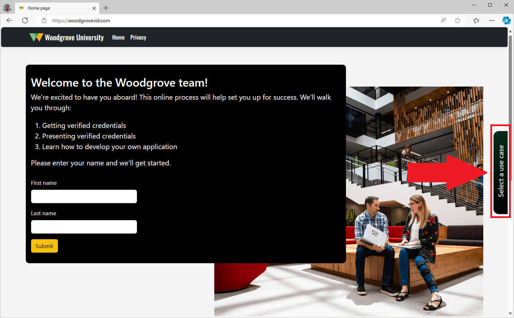
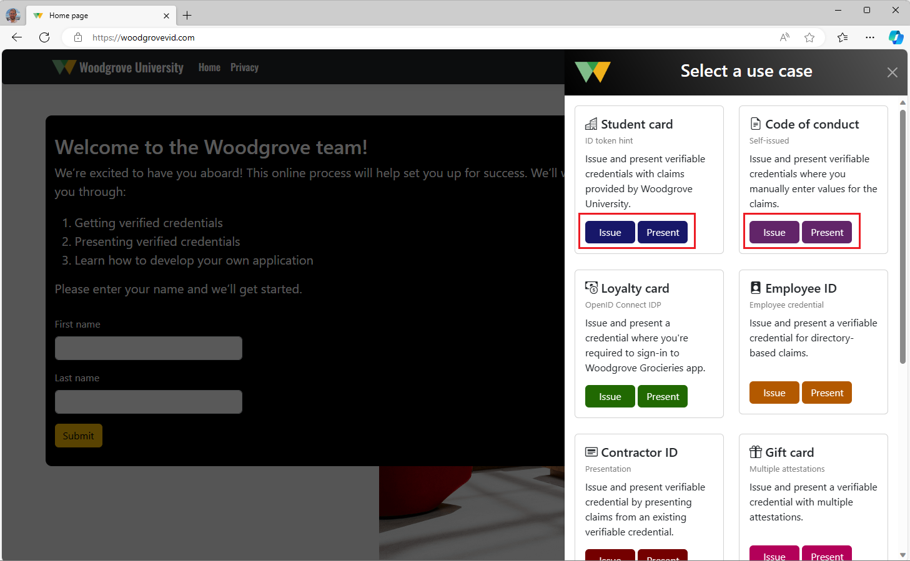
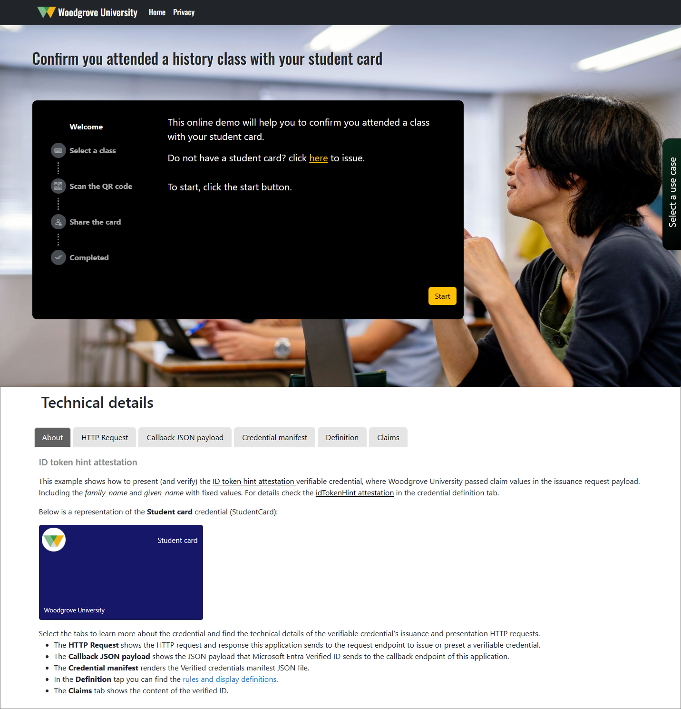

# Woodgrove verified ID demo

Microsoft Entra Verified ID is a managed verifiable credentials service based on open standards. Allows you to quickly onboard employees, partners, and customers. Digitally validate identity information to ensure trustworthy self-service enrollment and faster onboarding. And verify an individual’s credentials and status to grant least-privilege access with confidence.

This Woodgrove demo environment illustrates several of the most common verified ID issuance and presentation experiences that can be used for your needs.

## How to use the demo

To try out the demo, go to <https://woodgrovevid.com> and select from a list of use cases that illustrate different sign-in options and business cases.

Each demo allows you to issue a verified ID and then present it. You first issue a verified ID, then you can try out the presentation flow. If you already have the verified ID, you can delete it from the Microsoft Authenticator and repeat the issuance demo.

The pages are divided into two main sections. In the first top part of the page is where you can run the demo and experience the issuance and presentation demos by yourself. Scrolling down you can learn more how the demo, how it works and how to implement in own application. 

Under the **Technical details** section, select one of the tabs to learn more about the credential and find the technical details of the verified ID's issuance and presentation HTTP requests.

- The **HTTP Request** shows the HTTP request and response this application sends and receives from Microsoft Entra verified ID's **request endpoint** to issue or preset a verified ID.

- The **Callback JSON payload** shows all of the JSON payloads that Microsoft Entra Verified ID sends to the callback endpoint of this application. It includes the **request status** and the **time** it takes form the moment the demo starts, up to the time when of the callback endpoint was requested. 
    
    If you are not familiar with the callback endpoint, it allows the developer to asynchronously get information on the flow during the verifiable credential issuance process. For example, the developer might want a call when the user has scanned the QR code or if the issuance request succeeds or fails. So, you can investigate all the messages sent to the callback endpoint.

- The **Credential manifest** renders the credential manifest JSON file.

- In the **Definition** tab you can find the credential's rules and display definitions as configure in the Woodgrove demo environment.

- The **Claims** tab shows the content of the verified ID after a presentation process is completed.

## Data Collection

Your privacy is important to us. This privacy statement explains the personal data Woodgrove demo application collects and processes, and for what purposes. This Woodgrove Verified ID demo application  collects information about the use of the demo and send it to Microsoft. Microsoft may use this information to provide services and improve our products and services. Our privacy statement is located at https://go.microsoft.com/fwlink/?LinkID=824704. You can learn more about data collection and use in the help documentation and our privacy statement. Your use of the demo operates as your consent to these practices.

If you clone and run the demo in your own environment, you may turn off the telemetry by leaving the `ApplicationInsights:ConnectionString` in the [appsettings.json](appsettings.json) configuration file empty. 

### Information that you give us directly 

- During the issuance flow, you provide some of this data directly that is stored in your wallet app (Microsoft Authenticator app) and it remains only in your wallet. 
- Some of the credentials contains a key that is persisted, which allow us to revoke the credential. The key may be an auto generated ID, or the name or display name you provide.
- The purpose of this demo application is for illustration only. You are NOT obligated to provide your personal information, such as first name, last name, location etc. **Make sure NOT to use any of your real details that can reveal your identity**. 
- If a demo requires you to provider your email address (such as employee onboarding demo), you will be asked to consent sharing your email. The email will be stored in a temporary database, so we can validate the information and proceed with demo, then the record will be erased immediately.
- During the presentation flow, the claims from your verified ID (that is stored on your device) is sent back to this demo and presented to you. The demo does not persist this information anywhere.

### Information we collect automatically

- This Woodgrove demo app uses the [Application Insights](https://learn.microsoft.com/azure/azure-monitor/app/app-insights-overview) to collect telemetries to determine when, where, and how users interact with this demo. Check out the [Monitoring App Service data reference](https://learn.microsoft.com/azure/app-service/monitor-app-service-reference) for detailed information on App Service metrics and logs.

- In addition to the basic Application Insights telemetry, Woodgrove demo app collects the following data:

    - The **demo** users run, and the type of the **activity** (issuance or presentation).
    - The **time** (duration) it takes to run steps in the demo.
    - The **request Id** and **state** parameter.
    - The **request status** returns to the callback endpoint.
    - **Exceptions**, or errors that occur in either in the app or return to the callback API.
    - The **referral** that identifies the address of the web page, from which the page has been requested.

## Support

This demo application developed by Microsoft with the help of the community to demonstrate some of the Microsoft Entra verified ID use cases. The application and its source code is NOT supported under any Microsoft standard support program or service. If you find a bug, notice something but are not sure how to solve it, or want to provide product feedback, use the [Issues](https://github.com/microsoft/woodgrove-vid/issues) tab at the top of the page. You can also @mention collaborators who have access to this repository in an issue to draw their attention to a comment. 

## Using the source code

The source code provided on this GitHub repo is for the online demo environment <https://woodgrovevid.com>. You can download or clone it, modify, and distribute to your own environment. 

The code is provided "as is" without any warranty of any kind. The goal is to allow users to try some of the use cases by themself and also help shows the technical details, so you can implement it in your own environment. The contributors to the code make no assertions as to its performance, quality, and security (although we try). 

## Contributing

This project welcomes contributions and suggestions.  Most contributions require you to agree to a
Contributor License Agreement (CLA) declaring that you have the right to, and actually do, grant us
the rights to use your contribution. For details, visit https://cla.opensource.microsoft.com.

When you submit a pull request, a CLA bot will automatically determine whether you need to provide
a CLA and decorate the PR appropriately (e.g., status check, comment). Simply follow the instructions
provided by the bot. You will only need to do this once across all repos using our CLA.

This project has adopted the [Microsoft Open Source Code of Conduct](https://opensource.microsoft.com/codeofconduct/).
For more information see the [Code of Conduct FAQ](https://opensource.microsoft.com/codeofconduct/faq/) or
contact [opencode@microsoft.com](mailto:opencode@microsoft.com) with any additional questions or comments.

## Trademarks

This project may contain trademarks or logos for projects, products, or services. Authorized use of Microsoft 
trademarks or logos is subject to and must follow 
[Microsoft's Trademark & Brand Guidelines](https://www.microsoft.com/en-us/legal/intellectualproperty/trademarks/usage/general).
Use of Microsoft trademarks or logos in modified versions of this project must not cause confusion or imply Microsoft sponsorship.
Any use of third-party trademarks or logos are subject to those third-party's policies.
